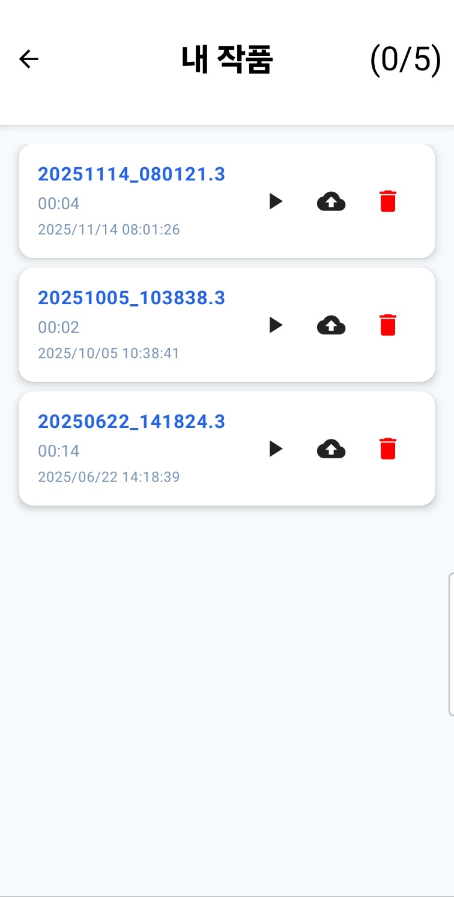
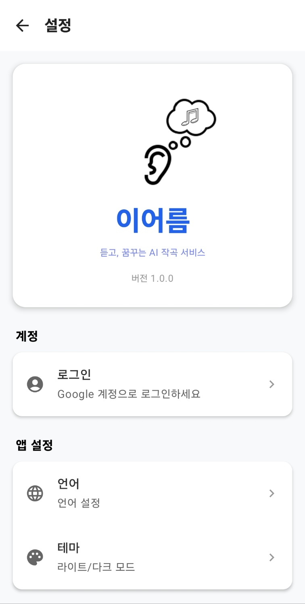

# 이어름 (Eaream) - AI 허밍 악보 생성 앱

[English Version](README.md)

> 허밍을 악보로 변환하는 AI 기반 안드로이드 애플리케이션

[]()
[]()
[]()
[]()

## 프로젝트 개요

이어름은 사용자의 허밍을 AI 서버로 전송하여 악보로 변환받는 안드로이드 애플리케이션입니다.
음악 이론 지식이 없는 일반 사용자도 녹음부터 악보 생성까지 단 몇 번의 터치로 완성할 수 있는 직관적인 모바일 UX에 중점을 두고 개발했습니다.

## 앱 스크린샷
<div align="center">
    
    
    
    
</div>

### 개발 정보
- **개발 기간**: 2025.03.07 ~ 2025.12.19 (졸업작품)
- **개발 환경**: Android Studio, Kotlin
- **배포 계획**: 2025년 11월 Google Play Store
- **역할**: Android 클라이언트 개발 (UI/UX, 아키텍처 설계, 전체 앱 개발)

### 사용자 경험
- **직관적인 UI**: 음악 비전공자도 쉽게 사용할 수 있는 심플한 인터페이스
- **사용량 관리**: 일일 사용 제한 및 사용량 추적 시스템
- **다국어 지원**: 한국어/영어 지원 (리소스 모듈화)

### 계정 및 데이터 관리
- **Google 로그인**: Firebase Auth를 통한 간편 인증
- **데이터 저장**: Room을 통해 로컬로 3gp 파일 관리. 서버를 통해 악보와 midi 파일 받아서 사용

## 안드로이드 아키텍처

### 전체 구조
```
📦 Eaream Android App
├── 📂 app (Application Module)
│   ├── manifests
│   ├── kotlin+java
│   │   └── com.largeblueberry.aicompose
│   ├── java (generated)
│   └── res
│
├── 📂 core (공통 모듈)
│   ├── analytics-api      # 분석 API 인터페이스
│   ├── analytics-impl     # 분석 구현체
│   ├── auth              # 인증 관련 공통 로직
│   ├── data              # 데이터 처리 공통 로직
│   ├── domain            # 도메인 공통 로직
│   ├── navigation        # 네비게이션 관리
│   ├── resources         # 공통 리소스
│   └── ui                # 디자인 시스템, 공통 컴포넌트
│
├── 📂 data (데이터 레이어)
│   ├── local             # Room 엔티티, DAO
│   └── remote            # Retrofit 관련 로직
│
├── 📂 feature (기능별 모듈)
│   ├── auth              # 로그인 및 사용자 관리
│   ├── library           # 녹음된 허밍 관리 및 업로드 관리
│   ├── record            # 음성 녹음
│   ├── setting           # 앱 설정 및 다국어 지원
│   └── sheetmusic        # 생성된 악보 보기
│
└── 📜 Gradle Scripts
```

### 주요 기술적 구현

#### 아키텍처 패턴
- **Clean Architecture + MVVM**: 확장성과 테스트 용이성을 위한 계층 분리
- **멀티 모듈 아키텍처**: core, data, domain, feature 단위로 모듈을 분리하여 빌드 시간 최적화 및 코드 재사용성 향상
- **단일 액티비티**: Navigation Component를 활용한 효율적인 화면 전환

#### 모듈별 역할
- **core**: 공통으로 사용되는 기능들을 세분화하여 관리
- `analytics-api/impl`: 사용자 행동 분석을 위한 추상화 계층
- `auth`: 인증 관련 공통 로직
- `navigation`: 앱 전체 네비게이션 관리
- `ui`: Material 3 기반 디자인 시스템
- **data**: 로컬(Room) 및 원격(Retrofit) 데이터 소스 관리
- **domain**: 비즈니스 로직 및 사용자 추적 기능
- **feature**: 각 화면별 독립적인 기능 모듈

#### UI/UX 구현
- **Jetpack Compose**: XML에서 Compose로 전면 전환
- **Material 3 Design**: 최신 디자인 가이드라인 적용
- **반응형 UI**: 다양한 화면 크기 대응
- **다크 테마**: 시스템 설정에 따른 자동 테마 전환

#### 성능 최적화
- **Hilt 의존성 주입**: 보일러플레이트 코드 감소 및 테스트 용이성
- **Coroutines + Flow**: 비동기 작업 및 상태 관리 최적화
- **모듈 분리**: 빌드 시간 단축 및 병렬 빌드 최적화

#### 오디오 처리
- **AudioRecord API**: 음성 녹음 구현
- **권한 관리**: 마이크 권한 요청 및 처리

#### 네트워크 및 데이터
- **Retrofit + OkHttp**: RESTful API 통신
- **Firebase**: Authentication
- **Room Database**: 로컬 데이터베이스를 활용해 녹음 파일 관리

## 기술 스택

### 개발 환경
- **IDE**: Android Studio Narwhal
- **언어**: Kotlin 100%
- **최소 SDK**: API 35
- **타겟 SDK**: API 35

### 주요 라이브러리
- **UI**: Jetpack Compose, Material 3
- **아키텍처**: Hilt, Navigation Component, ViewModel
- **비동기**: Coroutines, Flow
- **네트워크**: Retrofit, OkHttp
- **데이터베이스**: Room
- **인증**: Firebase Auth
- **분석**: 커스텀 Analytics 모듈

## About Developer

**개발자**: 신용우  
**연락처**: onlym3480@naver.com  
**프로젝트 성격**: 졸업작품 (개인 프로젝트)
